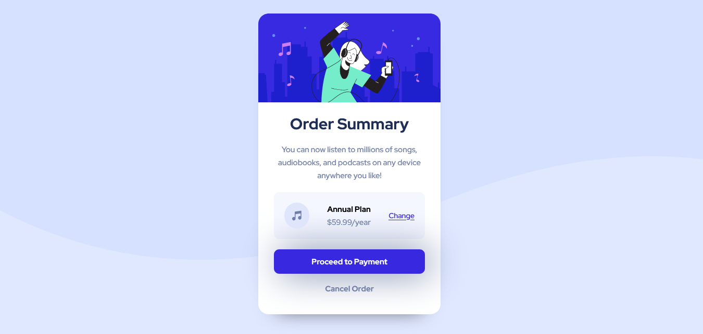

# Frontend Mentor - Solución de tarjeta de resumen de pedido

Esta es una solución al [Desafío de la tarjeta de resumen del pedido en Frontend Mentor](https://www.frontendmentor.io/challenges/order-summary-component-QlPmajDUj). Los desafíos de Frontend Mentor lo ayudan a mejorar sus habilidades de codificación mediante la creación de proyectos realistas.

## Tabla de contenido

- [Resumen](#resumen)
  - [Captura de pantalla](#captura de pantalla)
  - [Enlaces](#enlaces)
- [Mi proceso](#mi-proceso)
  - [Construido con](#construido con)
- [Autor](#autor)
- [Agradecimientos](#agradecimientos)

**Nota: elimine esta nota y actualice la tabla de contenido según las secciones que conserve.**

## Visión de conjunto

### Captura de pantalla

### Enlaces

- URL de la solución: [https://github.com/hdlfkja/Resumen-pedido.git]
- URL del sitio en vivo: [https://vista-previa-resumen-pedido.netlify.app/]

## Mi proceso

### Construido con

- Marcado HTML5 semántico
- Propiedades personalizadas de CSS
- Caja flexible
- Cuadrícula CSS
- Flujo de trabajo móvil primero

## Autor

- Mentor de frontend - [@hdlfkja](https://www.frontendmentor.io/profile/tunombredeusuario)
- Twitter - [@JeanCar27866009](https://twitter.com/JeanCar27866009)